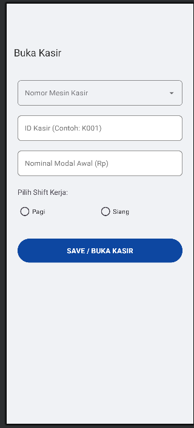
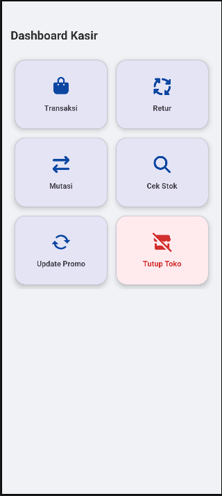

# ElZatta BPOS - Kelompok 1 - TIF RP 24 A CID

## Deskripsi Singkat
aplikasi ElZatta BPOS adalah perangkat lunak berbasis digital yang dirancang untuk mempermudah pencatatan transaksi penjualan. Sistem ini menggantikan mesin kasir konvensional karena mampu menghitung total belanja, mengelola stok barang, mutasi barang, dan mencetak laporan keuangan.

## Daftar Anggota

| No | Nama | NPM | Peran |
|----|------|-----|-------|
| 1 | Aldi Alfariz | 24552011212 | Frontend |
| 2 | As’ad Miftahul Haq | 24552011304 | QA Test |
| 3 | Bonafisius Alvis Satriya | 24552011152 | Backend |

## Video Penjelasan
[Video Penjelasan ElZatta BPOS](https://youtu.be/rhCy1EqzPZ4)

## Laporan
[Laporan Proyek ElZatta BPOS](https://drive.google.com/drive/folders/1zSzjzxurbGl6V7GJv5MvU30V2taemgZw?usp=drive_link)

## Screenshot Aplikasi

### Screenshot 1


### Screenshot 2


## Cara Menjalankan / Cloning Proyek

### Prasyarat
- Android Studio atau emulator Android
- Gradle build tools
- Java SDK

### Langkah-langkah Cloning

1. Clone repository ini:
   ```bash
   git clone https://github.com/asadmh-png/PM_Tugas_Besar.git
   cd PM_Tugas_Besar
   ```

2. Buka proyek di Android Studio:
   - File → Open → pilih folder proyek
   - Tunggu Gradle selesai build

3. Jalankan aplikasi:
   - Pilih perangkat atau emulator
   - Klik tombol Run atau tekan Shift + F10

### Menjalankan APK Langsung
1. Pastikan USB debugging aktif di perangkat
2. Buka terminal di folder `apk/`
3. Jalankan perintah:
   ```bash
   adb install app-release.apk
   ```
4. Aplikasi akan terinstall di perangkat Anda

## Struktur Proyek

```
PM_Tugas_Besar/
├── app/                  # Folder source code
├── apk/                  # Build APK
│   └── app-release.apk
├── docs/                 # Dokumentasi
│   └── Laporan_PMOB_ Kelompok 1.pdf
└── README.md
```